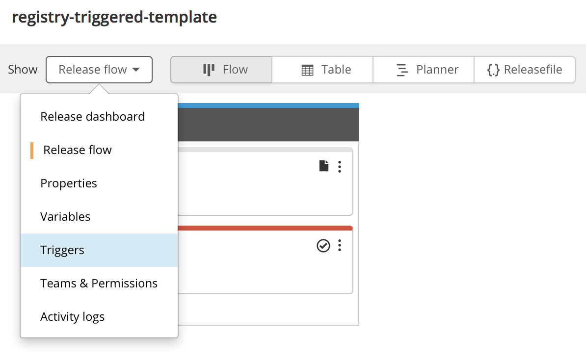
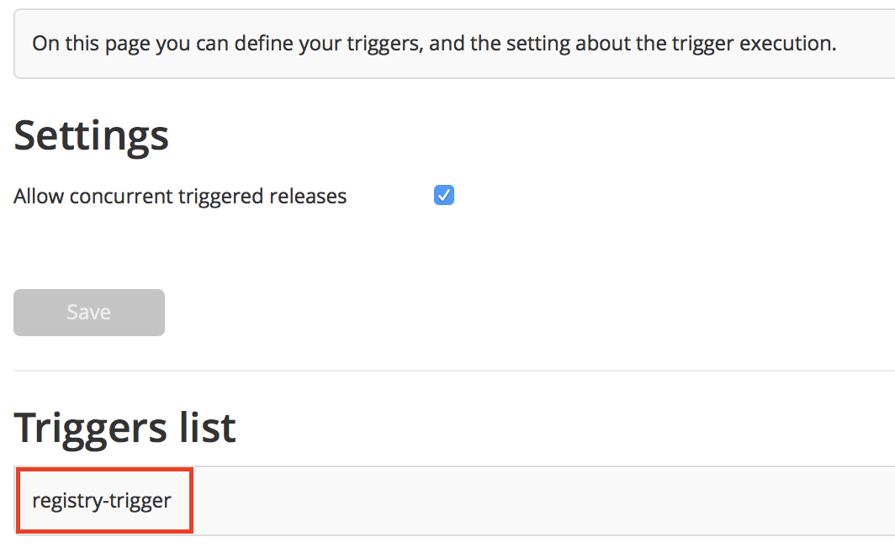
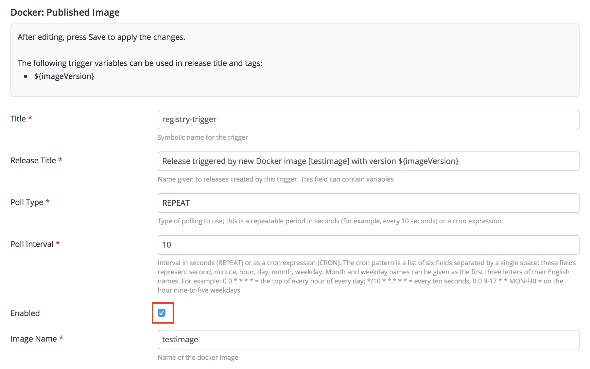
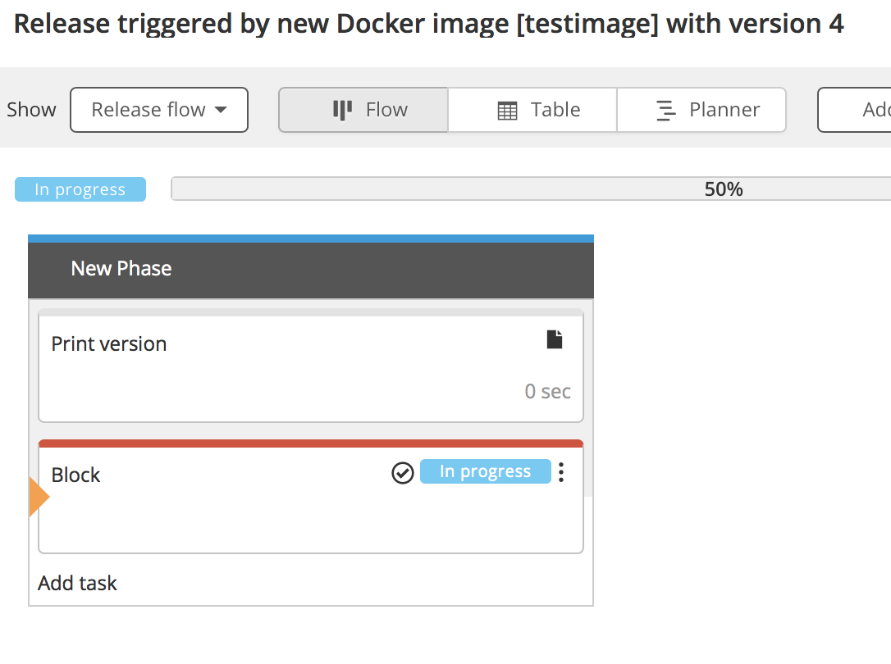

# Preface #

This document describes the functionality provided by the xlr-docker-registry-trigger-plugin.

See the **[XL Release Documentation](https://docs.xebialabs.com/xl-release/index.html)** for background information on XL Release and release concepts.

# CI status #

[![Build Status][xlr-docker-registry-trigger-plugin-travis-image] ][xlr-docker-registry-trigger-plugin-travis-url]
[![Build Status][xlr-docker-registry-trigger-plugin-codacy-image] ][xlr-docker-registry-trigger-plugin-codacy-url]
[![License: MIT][xlr-docker-registry-trigger-plugin-license-image] ][xlr-docker-registry-trigger-plugin-license-url]
[![Github All Releases][xlr-docker-registry-trigger-plugin-downloads-image] ]()

[xlr-docker-registry-trigger-plugin-travis-image]: https://travis-ci.org/xebialabs-community/xlr-docker-registry-trigger-plugin.svg?branch=master
[xlr-docker-registry-trigger-plugin-travis-url]: https://travis-ci.org/xebialabs-community/xlr-docker-registry-trigger-plugin
[xlr-docker-registry-trigger-plugin-codacy-image]: https://api.codacy.com/project/badge/Grade/b78313b1eb1b4b058dc4512b4d48c26f
[xlr-docker-registry-trigger-plugin-codacy-url]: https://www.codacy.com/app/rvanstone/xlr-docker-registry-trigger-plugin
[xlr-docker-registry-trigger-plugin-license-image]: https://img.shields.io/badge/License-MIT-yellow.svg
[xlr-docker-registry-trigger-plugin-license-url]: https://opensource.org/licenses/MIT
[xlr-docker-registry-trigger-plugin-downloads-image]: https://img.shields.io/github/downloads/xebialabs-community/xlr-docker-registry-trigger-plugin/total.svg

# Overview #

This plugin is a XL Release plugin that enables triggering new release based on a new docker image version showing up in a V2 registry.

There are many tools that implement Docker V2 Registry: [dockerhub](https://dockerhub.com), [docker registry](https://docs.docker.com/registry/) (which is included in this repo for testing), [Docker Secure Registry](https://docs.docker.com/registry/deploying/), [Artifactory](http://www.jfrog.com/confluence/display/RTF/Docker+Registry), [RedHat Package Manager](https://access.redhat.com/documentation/en-us/red_hat_enterprise_linux_atomic_host/7/single/getting_started_with_containers/index#creating_a_private_docker_registry_optional), [OpenShift](https://docs.openshift.com/container-platform/latest/install_config/registry/accessing_registry.html).. any many more. This plugin should work with them all.

## Installation ##

Place the latest released version under the `plugins` subdirectory in the XL Release installation directory.

This plugin requires XLR 6.0.x+

## Testing ##

### Start containers for testing ###

This repository contains testing code that can be executed by cloning the repository on your machine. For testing you need to have a docker daemon and docker-compose running on the machine while you are test. Use Google to find out how, nothing specific to XebiaLabs or XL Release needs to be done.

Once you have all prerequisies, run `./gradlew runDockerCompose` to spin up an XL Release conainer with this plugin (+ test data loaded) and a docker v2 registry container.

The template in there that will trigger when a new version of an image with name 'testimage' will be pushed to the registry, which is done from your local machine.

### Finish XL Release test setup ###

####IMPORTANT

Examples of docker registry url for configuration  

* http://localhost:5000/v2/ 
* https://registry.hub.docker.com/v2 

Now open up XL Release (see docker-compose.yml which port, but at time of writing localhost:15516) go into Design > Templates, find the `registry-triggered-template` and click on it, navigate to Triggers in the white dropdown (renders default with 'Release Flow').



Open the trigger



Enable it and enter the text `${imageVersion}` in the input field all the way to the bottom, slightly beyond what is captured in the screenshot below (sadly the auto-import of templates prevents this from happening automatically). 



XL Release is set up and waiting for the new versions to appear.

### Push new versions of a testimage ###

Run this on your local machine.

Pull (or build) some image from the hub. Example is ubuntu but you can use any image you like. The name `testimage` is the image that the preloaded trigger is monitoring for (see screenshot above).

````
docker pull ubuntu
````

Tag the image so that it points to the registry spun up by docker-compose

````
docker tag ubuntu localhost:5000/testimage:1
````

Push it

````
docker push localhost:5000/testimage:1
````

A release should have triggered.




And subsequently you create even more new versions as such:

````
docker tag ubuntu localhost:5000/testimage:2
docker push localhost:5000/testimage:2

docker tag ubuntu localhost:5000/testimage:3
docker push localhost:5000/testimage:3
````
And so on.

For Docker Registry docs and commands, see [here](https://docs.docker.com/registry/#basic-commands)
